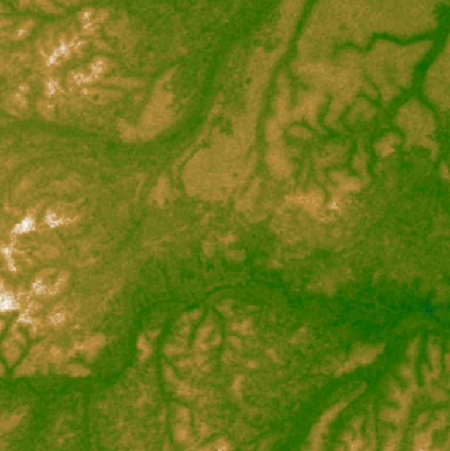

# Terrain Consistency Models

## Requirements
**Hardware:** An XLA-compatible device, 32GB+ RAM.
**Software packages:** jax, jaxlib, flax, optax, numpy, scipy, rasterio, torch, torchvision, wandb, transformers, jax_fid, sklearn, tqdm, pillow

## Dataset

The model is trained on samples from the [NASADEM Merged DEM Global 1 arc second](https://lpdaac.usgs.gov/products/nasadem_hgtv001/) digital elevation model dataset.

From the available 14520 `.tif` files in the merged NASADEM dataset, 4096 were randomly selected. The samples were further cut into `512x512` slices. The slices were filtered to exclude samples that contained no nonzero elevation. The remaining slices were sorted in decreasing order of entropy (calculated from a 256-bin histogram of the sample) and the top 100K samples were selected.

### Example 
    The terrain of Tshuapa, Democratic Republic of the Congo, features undulating hills and subtle ridges that suggest varying elevations, interspersed with intricate patterns of erosion. The landscape is characterized by extensive networks of stream beds and plateaus, indicating a dynamic interplay of fluvial processes and geological formations.

